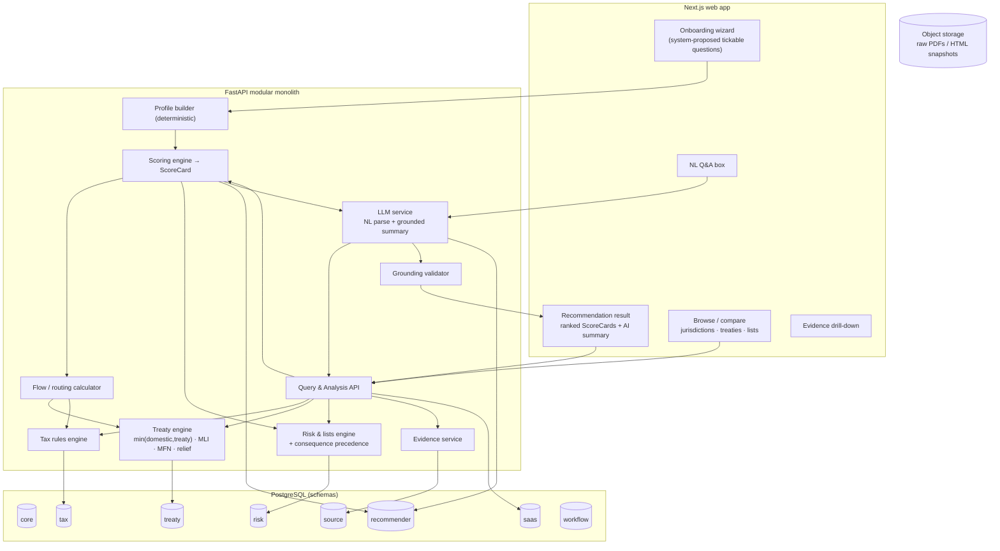

# Tax Jurisdiction & Compliance Recommender — Design Spec

**Status:** Draft for review
**Date:** 2026-10-04
**Author:** bakyt92 (with Claude Code)

> **Positioning:** A commercial SaaS tool for **tax professionals**. Given a
> structured business profile, it recommends where to incorporate a holding
> structure and summarizes the tax implications, backed end-to-end by a
> versioned, source-cited knowledge graph. Output is a **sourced working draft
> the professional validates** — informational, not tax advice.

> **Core principle (inherited):** domestic rate ≠ treaty cap ≠ amount withheld
> at payment ≠ effective rate ≠ FATF status ≠ EU tax-list status ≠ national
> consequence. **No figure is shown without official source evidence.**

---

## 1. Goal, users, success criteria

**Goal.** Let a tax professional enter a client's current business state through
a few tickable questions and receive a ranked set of candidate holding
jurisdictions, each with a transparent, sourced score and a flow-by-flow tax
summary they can validate and hand to a client.

**Primary user.** Tax advisor / professional. The output is technical and
complete (figures, articles, citations), not simplified. The professional is
the human-in-the-loop who validates before use.

**Success criteria (v1).**
- A professional completes onboarding (≤ 3 tickable questions) and gets a ranked
  recommendation with per-factor breakdown in one session.
- Every figure in every recommendation resolves to a cited official source.
- The ranking is **reproducible**: same profile + same data snapshot + same
  weight set + same engine version ⇒ identical ScoreCards.
- The LLM never emits a figure or list/jurisdiction claim absent from the
  engine's structured output (enforced, not hoped for).
- Coverage: 50–70 jurisdictions; CIT and VAT/GST; dividend/interest/royalty WHT;
  treaty status + rates for those three income types; EU tax list, FATF lists,
  EU AML list, Global Forum ratings, France ETNC; source citations and history.

**Non-negotiables.** Auditability, reproducibility, source-backing, and a hard
boundary between the deterministic engine (source of truth) and the LLM
(language in / language out only).

---

## 2. Architecture overview (Approach A: deterministic core, LLM as translator + explainer)



**Stack.** Python + FastAPI (modular monolith) · PostgreSQL (full-text search
first; OpenSearch later) · S3-compatible object storage · Celery/Dramatiq
workers · React/Next.js · Pydantic + DB constraints · Docker. No microservices
or graph database until the data model stabilizes. LLM is model-agnostic behind
an interface; default provider **Mistral**.

**Component responsibilities.**

| Component | Responsibility | Trust level |
|---|---|---|
| Tax rules engine | Domestic rates, brackets, exemptions, holding regimes | Source of truth |
| Treaty engine | `min(domestic, treaty)`, MLI matching, MFN, relief mechanism | Source of truth |
| Risk & lists engine | EU/FATF/EU-AML/ETNC/Global Forum + consequence precedence | Source of truth |
| Flow/routing calculator | End-to-end tax leakage leg by leg for a profile's flows | Source of truth |
| Scoring engine | Weighted ScoreCard from the four factors + guardrails | Source of truth |
| Evidence service | Resolve any figure to cited `source_evidence` | Source of truth |
| Profile builder | Map tickable answers → structured `Profile` | Deterministic |
| LLM service | NL question → structured query; ScoreCard → cited prose | **Language only** |
| Grounding validator | Reject LLM output containing unsourced figures/claims | Guardrail |

---

## 3. The balanced scoring model

For a candidate holding jurisdiction **H** and structured profile **P**, the
Scoring engine emits a **ScoreCard**: an overall `0–100` score as a weighted sum
of four independently computed, sourced factors. Weights come from a named
`weight_set` (ships with a sensible default; tunable per run).

### Factor 1 — Tax efficiency (primary weight)
The Flow calculator models each expected flow `Source S → Holding H → Ultimate
parent U` and computes total tax leakage:
- WHT on `S → H` = `min(domestic_S, treaty_S_H)` + relief mechanism (at
  source / refund / credit), honoring MLI and MFN.
- H's CIT on the income, **after H's participation exemption** on inbound
  dividends / capital gains (with its conditions: min holding %, holding period,
  subject-to-tax).
- WHT on the onward distribution `H → U` = `min(domestic_H, treaty_H_U)`.
Lower total leakage ⇒ higher sub-score. Every rate carries a citation.

### Factor 2 — Compliance standing
Penalties for H's membership on EU Annex I/II, FATF grey/black, Global Forum
rating below a threshold, and **ETNC status relative to the profile's
counterparty jurisdictions**. Each membership sourced and dated.

### Factor 3 — Treaty-network breadth
Share and quality (headline WHT) of the profile's counterparty jurisdictions
with which H has an **in-force** treaty. Measures routing flexibility. Backed by
the `treaty_coverage` materialized view.

### Factor 4 — Substance burden (coarse in v1)
H's economic-substance / ESR requirement **band** (low / medium / high) and
anti-abuse (PPT) / parent-country CFC exposure, weighed against the profile's
declared **substance-capacity band**. v1 is deliberately a flags-and-bands model,
not a substance calculator — honest over fake-precise.

### Hard rules
- **Guardrails override the score.** A FATF-blacklisted jurisdiction, or an
  ETNC for the user's key counterparties, is capped and flagged regardless of
  tax score — computed in the engine, never an LLM judgment.
- **Weights are explicit and tunable.** The ScoreCard always exposes the
  per-factor breakdown so the professional sees *why* H ranked where it did and
  can re-weight.

### ScoreCard (structured output)
```jsonc
{
  "jurisdiction": "NL",
  "overall_score": 78.4,
  "rank": 2,
  "weight_set": "default-v1",
  "data_asof": "2026-10-01",
  "engine_version": "1.0.0",
  "factors": {
    "tax_efficiency":   { "score": 85.0, "weight": 0.45 },
    "compliance":       { "score": 95.0, "weight": 0.20 },
    "treaty_breadth":   { "score": 70.0, "weight": 0.20 },
    "substance_burden": { "score": 55.0, "weight": 0.15 }
  },
  "flow_breakdown": [
    { "leg": "FR→NL dividends", "rate": 0.0, "rule": "treaty art.", "source_id": "ev_123" }
  ],
  "guardrail_flags": [],
  "citations": ["ev_123", "ev_456"]
}
```
The LLM summary narrates this object and nothing else.

---

## 4. Data model

Inherits the architecture doc's schemas and the review's corrections
(`treaty_party`, `relief_mechanism`, `exclusive_residence_taxation`,
`mli_position`, exclusion constraints, EU AML list, ETNC consequence). **Deltas
required by the recommender:**

### `tax` additions
- **`holding_regime`** — `jurisdiction_id`, `participation_exemption_dividends`
  (bool), `participation_exemption_capgains` (bool), `min_holding_pct`,
  `min_holding_period_months`, `subject_to_tax_condition` (bool),
  `conditions` (jsonb), `valid_period` (daterange), evidence FK. *Essential:* a
  holding recommender is meaningless without participation exemptions.
- **`substance_rule`** — `jurisdiction_id`, `regime` (e.g. ESR),
  `requirement_band` (low/med/high), `activity_scope`, `valid_period`,
  evidence FK.
- **`cfc_rule`** — `jurisdiction_id` (the *parent* country applying CFC),
  `low_tax_threshold`, `effect`, `valid_period`, evidence FK. Coarse in v1.

### `treaty` additions
- **`treaty_coverage`** (materialized view) — `jurisdiction_a`,
  `jurisdiction_b`, `in_force`, `headline_div_wht`, `headline_int_wht`,
  `headline_roy_wht`. Refreshed on treaty data change; powers Factor 3.

### New `recommender` schema
- **`weight_set`** — `name`, `weights` (jsonb), `is_default`.
- **`profile`** — `org_id`, `created_by`, `answers` (jsonb, raw ticks),
  `derived` (jsonb: flows, counterparties, parent jurisdiction, substance
  capacity band), `status`, `created_at`.
- **`scoring_run`** — `profile_id`, `weight_set_id`, `engine_version`,
  `data_asof`, `created_at`.
- **`scorecard`** — `scoring_run_id`, `jurisdiction_id`, `overall_score`,
  `factor_scores` (jsonb), `flow_breakdown` (jsonb), `guardrail_flags` (jsonb),
  `rank`.
- **`question_definition`** — `code`, `text`, `options` (jsonb), `maps_to`
  (profile field), `order`, `active`. The question set is **system-owned
  config**, not user free text.

### New `llm_interaction` audit (in `workflow`)
`kind` (nl_parse | summary), `input_ref`, `model`, `prompt_version`, `output`,
`grounding_status` (pass/repaired/rejected), `citations` (jsonb), `latency_ms`,
`cost`, `created_at`.

### New `saas` schema
`organisation_account`, `user`, `membership` (role: admin/analyst/viewer),
`api_key`, `usage_event`, `plan`.

### Temporal integrity (inherited)
Bitemporal: `valid_period` (legal applicability) + `recorded_at`/snapshots
(system time). Overlaps rejected at write time via `btree_gist` exclusion
constraints on versioned rule tables.

---

## 5. LLM subsystem & guardrails

**Job 1 — NL-query parser.** Free-form question → structured `QueryIntent`
(income category, source/residence jurisdictions, payment date, taxpayer type,
etc.) via read-only function/tool calls against a fixed schema. The parsed
intent runs through the *same* deterministic engines as the forms path — the
LLM chooses *what* to ask, never *what the answer is*.

**Job 2 — Summary generator.** Input is a ScoreCard (or engine query result) as
JSON. Output is prose with **inline citation IDs** resolving to
`source_evidence`. Prompt instructs: narrate only the provided figures; attach a
citation to every claim; flag where `interpretation_required`.

**Grounding validator (guardrail).** After generation, cross-check every number,
jurisdiction code, and list name in the LLM output against the structured input:
- Numbers must match a value present in the input (within formatting tolerance).
- Every jurisdiction/list/treaty claim must have a citation ID present in the
  input's `citations`.
- On mismatch: one repair regeneration; if it still fails, **reject** and fall
  back to a deterministic template rendering of the ScoreCard. Never surface an
  ungrounded summary.

**Audit.** Every call logged to `llm_interaction` with grounding status and cost.

**Model.** Interface-based; default **Mistral**. Swappable without touching
engine code.

---

## 6. Onboarding & profile

The system proposes **2–3 tickable questions** (no free-text input):

1. **Business size** — bands (e.g. micro / SME / mid-market / large).
2. **General activity** — e.g. trading goods · SaaS/IP licensing · holding &
   investment · services.
3. **Expected transactions / flows** (multi-select) — dividends from
   subsidiaries · royalties/IP · interest/financing · capital gains on exit —
   **plus** counterparty regions/jurisdictions (where income arises) and the
   ultimate-parent location.

`question_definition` holds the set as config. The **Profile builder**
(deterministic) maps answers → a structured `Profile`: a set of expected flows
with source and parent jurisdictions, a substance-capacity band, and the
activity type. No LLM in this path.

---

## 7. Website surfaces (Next.js)

- **Onboarding wizard** — stepper with system-proposed tickable options.
- **Recommendation result** — ranked candidate holdings as ScoreCards (overall +
  per-factor bars + guardrail flags); expandable **flow-by-flow tax computation**
  with each rate's citation; an **AI summary** at the top, clearly labeled
  *"AI-generated narration of the figures below"*; a **re-weight** control.
- **Browse** — jurisdiction / treaty / list pages.
- **Compare** — side-by-side jurisdictions.
- **NL Q&A** — compiles to a structured query; answer shows the structured
  result + grounded prose + sources.
- **Evidence drill-down** — source document, article, quoted text, snapshot, dates.
- **Disclaimers** throughout: informational working draft for professionals, not
  tax advice; verify against official sources.

---

## 8. SaaS plumbing

- **Auth** — organizations, users, roles (admin / analyst / viewer); sessions +
  API keys.
- **Metering** — `usage_event` per analysis/API call and per LLM call (cost);
  **billing-ready** (Stripe integration deferred to post-v1; metering present
  from the start).
- **Rate limiting** per key/plan; **audit log** (in `workflow`).
- **Public API v1** — the architecture doc's surface plus:
  - `GET  /v1/onboarding/questions`
  - `POST /v1/profiles`
  - `POST /v1/analyze/holding-recommendation` → ranked ScoreCards (+ optional
    `summarize=true` for the grounded prose)
  - existing `/v1/analyze/withholding-tax`, `/double-taxation`,
    `/jurisdiction-risk`, `/jurisdictions`, `/treaties`, `/lists`, `/sources`,
    `/records/{id}/evidence`.

---

## 9. Phased build order

Each phase later gets its own implementation plan (writing-plans).

| Phase | Deliverable |
|---|---|
| **P0 Foundations** | Repo, modular-monolith skeleton, `core`+`source`+`saas` schemas, auth/org, CI, Docker, evidence-service stub |
| **P1 Tax + treaty core** | Versioned `tax`/`treaty` tables, exclusion constraints, `holding_regime`; seed **France–UAE verified data** as the first golden fixture |
| **P2 Lists & review** | EU tax list, FATF, EU AML, ETNC, Global Forum ingestion; consequence precedence; human-review workflow |
| **P3 Engines** | Tax, Treaty (min/MLI/MFN/relief), Flow/routing calculator, Risk — all with golden tests |
| **P4 Scoring** | Scoring engine, ScoreCard, `weight_set`, guardrails; reproducibility tests |
| **P5 Product UI** | Onboarding wizard, Profile builder, recommendation result UI, browse/compare |
| **P6 LLM** | NL parser, summary generator, grounding validator, `llm_interaction` audit |
| **P7 SaaS hardening** | Metering (billing-ready), rate limits, API keys, public API |
| **P8 Scale** | Extend to 50–70 jurisdictions; human-reviewed assisted extraction |

**Demo milestone:** end of P5 gives a demoable France–UAE-deep recommendation;
P6 adds the AI summary; P8 reaches full MVP breadth.

---

## 10. Testing & correctness strategy

- **Golden fixtures** — France–UAE and a small set of jurisdictions verified by
  hand against official texts; engine outputs snapshot-tested.
- **Property tests** — effective source rate ≤ domestic; guardrails always cap
  blacklisted/ETNC; ScoreCard reproducible given `(data_asof, weight_set,
  engine_version)`.
- **Grounding tests** — inject hallucinated figures into LLM output; validator
  must catch and repair/reject.
- **Bitemporal tests** — no overlapping versions; as-of queries reproducible.
- **Evidence completeness (CI gate)** — no published figure without ≥ 1 source;
  `human_verified` requires a named reviewer.
- **Recommendation snapshots** — representative profiles → expected ranking,
  reviewed when data or weights change.

---

## 11. Non-goals (v1)

Tax-return/filing calculation · transfer pricing · a full substance/CFC
calculator (coarse bands only) · automated **unreviewed** PDF extraction · live
Stripe billing (metering only) · microservices / graph DB · tax advice (output
is a sourced working draft for professionals). The LLM never ranks and never
produces an unsourced figure.

---

## 12. Open questions / risks

- **Participation-exemption data depth.** Modeling conditions accurately across
  50–70 jurisdictions is the heaviest data task; P1/P8 must budget for it.
- **Counterparty granularity in onboarding.** Regions vs. specific countries
  trades UX simplicity against routing accuracy; starting with specific
  countries for the parent + key sources is recommended.
- **Weight defaults.** The default `weight_set` encodes a point of view; it must
  be reviewed by a tax professional before launch and shown transparently.
- **Legal/liability review.** Disclaimers and "working draft" positioning should
  be reviewed by counsel before commercial launch.

---

*Design reference, not legal or tax advice. All rates and list statuses must be
verified against official sources before use.*
